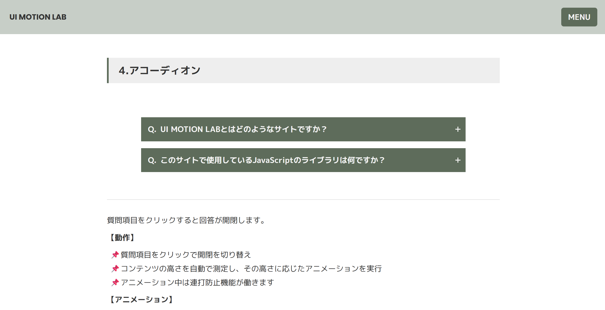

# 🎨 UI Motion Lab

**🔗 デモ URL:**
https://hiron-folio.com/portfolio/lp/ui-motion-lab/

これまでの学習で作成した、 UI コンポーネント集。

---

### 🖥 使用技術

HTML / SCSS / JavaScript / GSAP

### 🚀 制作ポイント

- 実用的な **UI コンポーネント**を複数実装（アコーディオン、モーダル、タブメニューなど）
- **GSAP** によるスムーズなアニメーション

### 📦 実装コンポーネント

- アコーディオン
- モーダル
- タブメニュー
- ドロップダウンメニュー
- ナビゲーションメニュー（ハンバーガーメニュー）
- Sticky ヘッダー
- テーマ切り替え（ライト/ダークモード）

### 推奨エディターと拡張機能（Cursor / VS Code）

- **Live Sass Compiler**：SCSS のリアルタイムコンパイル
- **Prettier**：HTML / SCSS / JS / JSON 等のコード整形
